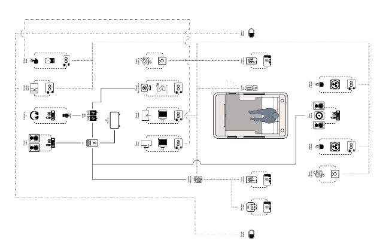

# The Future Mundane Engine

## The Caravan architecture
The future mundane engine brings together a large number of sensors and actuators to create immersive experiences inside our bespoke caravan. The engine runs off a set of scripted rules that determine which events will cause which actions to occur. In adddition it presents a wizard of oz interface that can be used to manually trigger rules and to monitor the current state of the experience.

Thanks to <a href="http://imagination.lancaster.ac.uk/person/matt-pilling/">Matt Pilling</a> for the following architecture diagram. 

## Authoring new experiences
We are currently working on a bespoke Twine application that interfaces with the caravan.  Content creators can rapidly build and test new experiences.  The system is in a fledgling state, but is being used in earnest by researchers.
